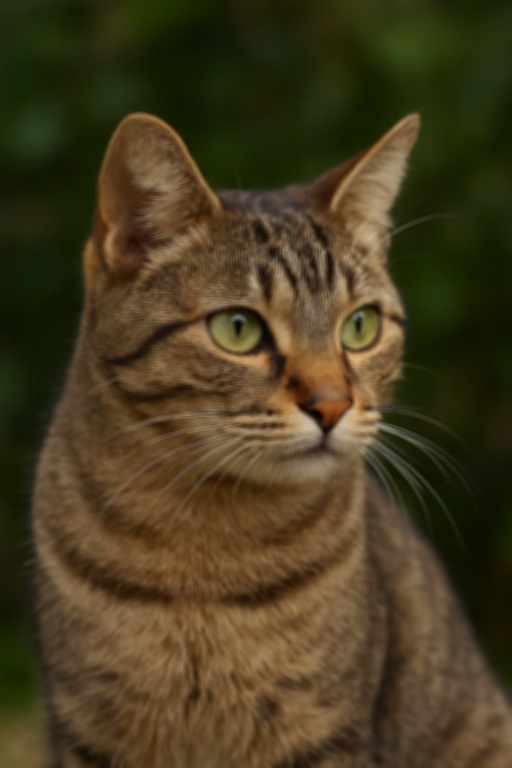
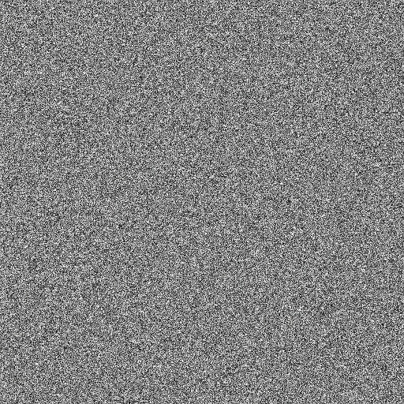
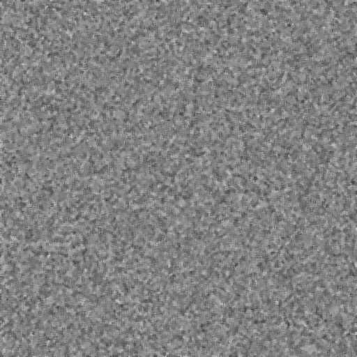
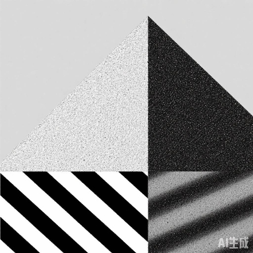
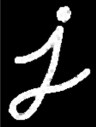

# 平滑图像
## 1均值滤波
1. 代码
   `cv2.blur(src, ksize)`
   - src: 输入图像。
   - ksize: 滤波器的大小，通常是一个奇数这个参数控制了每个像素周围考虑的邻域大小
```
import cv2
import numpy as np

scale_factor = 0.5

image = cv2.imread('C:\\Users\Lenovo\Desktop\study\image\cat.png')

scaled_image = cv2.resize(image, None, fx=scale_factor, fy=scale_factor, interpolation=cv2.INTER_CUBIC)
    # 应用均值滤波，使用 5x5 的滤波核
kernel_size = (5, 5)
blurred_image = cv2.blur(scaled_image, kernel_size)

cv2.imshow('Original Image', scaled_image)
cv2.imshow('Blurred Image', blurred_image)
cv2.imwrite('gray_image.jpg', scaled_image)
cv2.imwrite('blurred_image.jpg', blurred_image)
while True:
    if cv2.waitKey(1) & 0xFF == ord('q'):
         break
cv2.destroyAllWindows()

```
 
 

1. 效果
   图像变得更平滑，随机噪声削弱
   缺点：图片变得模糊
## 2高斯滤波
 1. 代码
``` 
   import cv2
import numpy as np

image = cv2.imread('C:\\Users\Lenovo\Desktop\study\image\\gaosi.png')

scale_factor = 0.5

scaled_image = cv2.resize(image, None, fx=scale_factor, fy=scale_factor, interpolation=cv2.INTER_CUBIC)

blurred_image = cv2.GaussianBlur(scaled_image, (5, 5), 1.5)

cv2.imshow('Original Image', scaled_image)
cv2.imshow('Blurred Image', blurred_image)

while True:
    if cv2.waitKey(1) & 0xFF == ord('q'):
         break
cv2.destroyAllWindows()
```


2. 效果
   高斯滤波有效平滑图像，相较于均值滤波，高斯滤波在处理图像时能更好地保留图像的边缘，减少了对边缘的模糊影响，数学模型具有良好的连续性和平滑性，适用于各种图像处理任务
   缺点：计算量大，边缘处理弱，无法去除所有噪声。
# 去噪
## 1中值滤波
1. 代码
··· 
import cv2
import numpy as np

image = cv2.imread('C:\\Users\Lenovo\Desktop\study\image\\gaosi.png')

scale_factor = 0.5

scaled_image = cv2.resize(image, None, fx=scale_factor, fy=scale_factor, interpolation=cv2.INTER_CUBIC)

kernel_size = 5  # 内核大小
median_blurred_image = cv2.medianBlur(scaled_image, kernel_size)

cv2.imshow('Original Image', scaled_image)
cv2.imshow('Blurred Image', median_blurred_image)
cv2.imwrite('zhongzhiori.jpg', scaled_image)
cv2.imwrite('zhongzhiblu.jpg', median_blurred_image)
while True:
    if cv2.waitKey(1) & 0xFF == ord('q'):
         break
cv2.destroyAllWindows()
···


2. 效果
   特别擅长去除椒盐噪声，能够有效消除图像中的孤立噪点，相比于均值滤波，中值滤波更能保留图像的边缘细
   缺点：对于高斯噪声或其他类型的噪声，效果并不如高斯滤波等方法
## 2双边滤波
1. 代码
``` 
   import cv2
import numpy as np

image = cv2.imread('C:\\Users\Lenovo\Desktop\study\image\\1.png')

scale_factor = 0.5

scaled_image = cv2.resize(image, None, fx=scale_factor, fy=scale_factor, interpolation=cv2.INTER_CUBIC)

# 设置双边滤波参数
d = 9  # 邻域直径
sigma_color = 75  # 色彩空间的标准差
sigma_space = 75  # 坐标空间的标准差

# 应用双边滤波
bilateral_filtered_image = cv2.bilateralFilter(scaled_image, d, sigma_color, sigma_space)

cv2.imshow('Original Image', scaled_image)
cv2.imshow('Blurred Image', bilateral_filtered_image)
cv2.imwrite('shuangbianzhiori.jpg', scaled_image)
cv2.imwrite('shuangbianblu.jpg', bilateral_filtered_image)
while True:
    if cv2.waitKey(1) & 0xFF == ord('q'):
         break
cv2.destroyAllWindows()

```



# 形态学降噪
## 1开运算
 1. 代码
`cv2.morphologyEx(src, op, kernel)`
- src：输入图像，可以是灰度图像或二值图像。
- op：操作类型，指定要执行的形态学操作。cv2.MORPH_OPEN 表示开运算。
- kernel：结构元素，用于执行形态学操作。结构元素决定了运算中考虑的像素范围，常用的是正方形、圆形或十字形的核
```
    import cv2
import numpy as np
image = cv2.imread('C:\\Users\Lenovo\Desktop\study\image\\1.png',0)

scale_factor = 0.5

scaled_image = cv2.resize(image, None, fx=scale_factor, fy=scale_factor, interpolation=cv2.INTER_CUBIC)
kernel = np.ones((5, 5), np.uint8)

# 使用开运算去噪
opening = cv2.morphologyEx(scaled_image, cv2.MORPH_OPEN, kernel)

cv2.imshow('Original Image', scaled_image)
cv2.imshow('Blurred Image', opening)
# cv2.imwrite('shuangbianzhiori.jpg', scaled_image)
cv2.imwrite('openblu.jpg', opening)
while True:
    if cv2.waitKey(1) & 0xFF == ord('q'):
         break
cv2.destroyAllWindows()
```
 
2. 效果
   开运算通过先腐蚀后膨胀来去除小的噪声点
## 2闭运算
 1. 代码
`cv2.morphologyEx(src, op, kernel)`
- src：输入图像，可以是灰度图像或二值图像。
- op：操作类型，指定要执行的形态学操作。cv2.MORPH_CLOSE 表示开运算。
- kernel：结构元素，用于执行形态学操作。结构元素决定了运算中考虑的像素范围，常用的是正方形、圆形或十字形的核
```
import cv2
import numpy as np
image = cv2.imread('C:\\Users\Lenovo\Desktop\study\image\\2.png',0)

scale_factor = 0.5

scaled_image = cv2.resize(image, None, fx=scale_factor, fy=scale_factor, interpolation=cv2.INTER_CUBIC)
kernel = np.ones((5, 5), np.uint8)

closing = cv2.morphologyEx(scaled_image, cv2.MORPH_CLOSE, kernel)

cv2.imshow('Original Image', scaled_image)
cv2.imshow('Blurred Image', closing)
cv2.imwrite('ori.jpg', scaled_image)
cv2.imwrite('closeblu.jpg', closing)
while True:
    if cv2.waitKey(1) & 0xFF == ord('q'):
         break
cv2.destroyAllWindows()
```

2. 效果
    闭运算通过先膨胀后腐蚀来填补图像中的小孔洞或连接断裂部分
## 3腐蚀膨胀
1. 腐蚀、
   `cv2.erode(image, kernel, iterations=1)`
2. 膨胀
   `cv2.dilate(image, kernel, iterations=1)`
## 4梯度
`cv2.morphologyEx(image, cv2.MORPH_GRADIENT, kernel)`
形态学梯度操作通过计算膨胀与腐蚀的差异，突出图像的边缘
## 5顶帽黑帽
1. 顶帽
    `cv2.morphologyEx(image, cv2.MORPH_TOPHAT, kernel)`
    顶帽操作用于提取图像中比背景亮的部分，通常用于小亮点的提取
2. 黑帽
   `cv2.morphologyEx(image, cv2.MORPH_BLACKHAT, kernel)`
   黑帽操作用于提取图像中的小黑点或小暗斑
# 卡尔曼滤波
